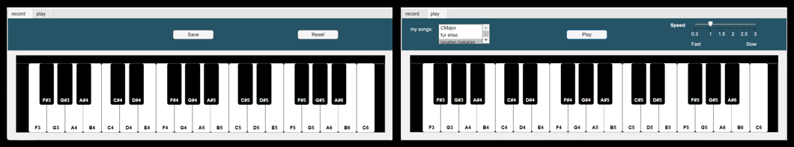
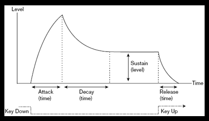

# Piano Application in Matlab

This is a piano application implemented in Matlab that provides users with the ability to play the piano keyboard and save a melody for later playback.

### Features
* Calculates frequency for each note and adds harmonics for richer sound

* Edit sound amplitude in the timeline
* Apply convolution with impulse response and low pass filter for sound customization
* Save created tunes into excel files for later playback

With its various features for sound customization and tune saving, this piano application provides an interactive and engaging musical experience for users.
